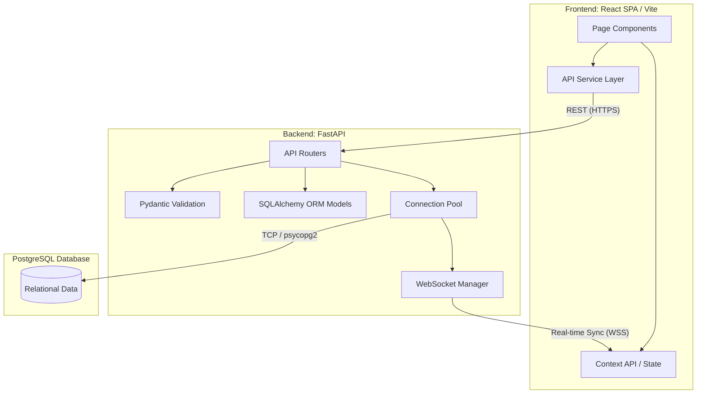
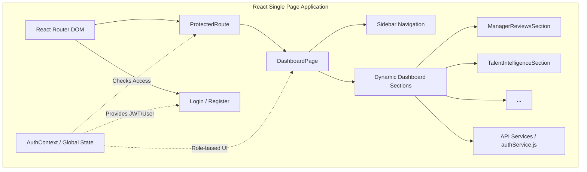
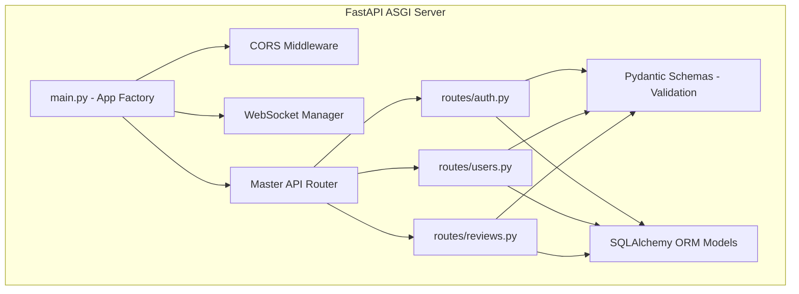
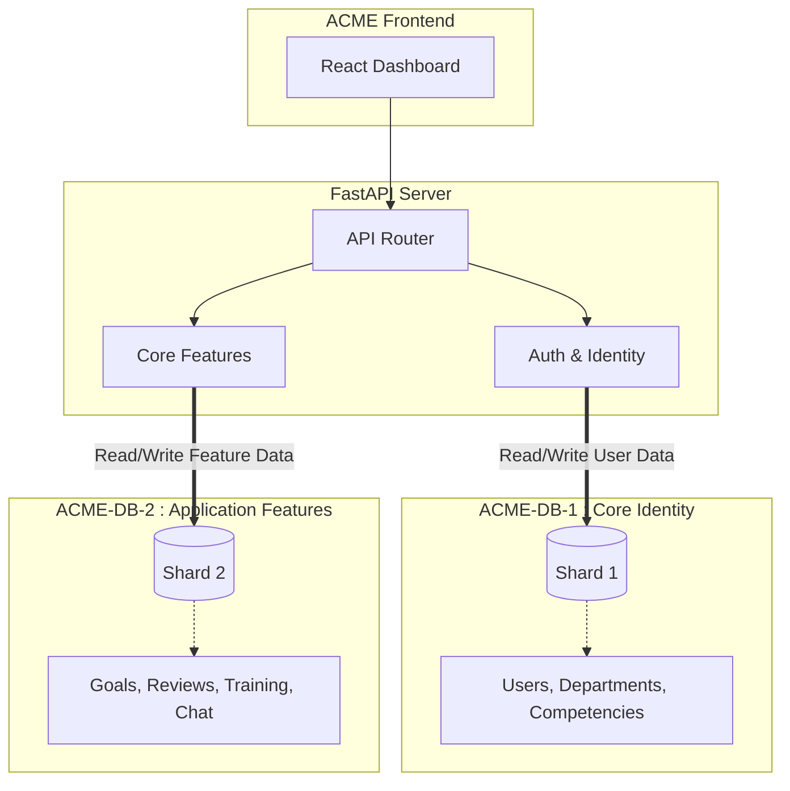

# ACME Talent Hub 🏢

A comprehensive, centralized platform for performance management, employee development, and talent intelligence. 

## 🎯 The Problem We Solve
Organizations often struggle to track employee performance and growth over time due to fragmented tools. We built ACME Talent Hub to answer critical organizational questions:
- What are the performance ratings and review history for each employee?
- Which employees have critical skill gaps in key competencies?
- Who are the high-potential employees ready for promotion?
- What training and development activities have been completed by each employee?
- Which employees are at risk of attrition based on performance trends?
- How does employee performance correlate with team and project outcomes?
- What is the distribution of skills across the organization?

---

## 🏗️ System Architecture & Structure

The ACME Talent Hub is designed using a decoupled client-server architecture, utilizing real-time WebSockets and a relational database.

### 💻 1. Frontend Architecture (`/frontend`)
The frontend is a Single Page Application (SPA) built for extreme modularity.

- **`src/App.jsx`**: The core router and theme provider. Handles code-splitting (React.lazy) and Suspense boundaries.
- **`src/context/AuthContext.jsx`**: Global state management. It manages JWT token storage (in `localStorage`), user session persistence, and dynamic UI elements based on roles (Manager vs. Employee).
- **`src/components/`**: Reusable generic UI components like `Modal` and `ProtectedRoute` (which securely intercepts unauthorized access).
- **`src/pages/`**: The main route views (`DashboardPage`, `LoginPage`, `RegisterPage`).
- **`src/pages/sections/`**: Modular, plug-and-play dashboard panels. For example, `ManagerReviewsSection` is dynamically injected into the Dashboard if the `user.role` is 'manager'.
- **`src/services/authService.js`**: An abstraction layer that cleanly encapsulates all native `fetch()` calls to the backend, catching network errors before they reach the UI.

### ⚙️ 2. Backend Architecture (`/backend`)
The backend is a high-performance ASGI web server written in Python.

- **`app/main.py`**: The application entry point. It configures CORS (allowing the frontend to communicate with it), initializes the WebSocket route, and mounts all the sub-routers.
- **`app/routes/`**: Contains endpoint logic separated by domain (e.g., `auth.py`, `users.py`, `reviews.py`). This keeps the codebase highly organized.
- **`app/schemas/schemas.py`**: Uses Pydantic to enforce strict type-checking on incoming HTTP requests and outgoing responses. If a frontend sends a string where an integer is expected, this layer rejects it with a 422 error.
- **`app/models/models.py`**: Contains the SQLAlchemy Object-Relational Mapping (ORM). Here, Python classes (like `User` or `PerformanceReview`) are defined to perfectly mirror the PostgreSQL tables.

### 🗄️ 3. Database Architecture (Service-Based Sharding)
The database connection architecture uses **Service-Based Sharding**. Because ACME Talent Hub is an internal tool, we don't need complicated multi-tenant isolation. Instead, we split the databases by **Service Domain** for maximum performance and organized scale.

#### Why are we doing this? (Simple English Explanation)
Imagine a huge library. If you put the index cards (where to find books) and the reading rooms (where people sit and read for hours) in the exact same tiny room, the index card line gets blocked by people reading.

Similarly, if ACME grows to thousands of employees, keeping all data in one database causes problems:
- **It Slows Down:** Running heavy analytical queries (like calculating company-wide performance) can slow down simple tasks (like logging in).
- **Single Point of Failure:** If one database crashes, everything stops working.

By separating the data:
- **Shard 1 (The Index):** Stores `users`, `departments`, and `competencies`. It handles quick, secure authentication and identity lookups.
- **Shard 2 (The Reading Room):** Stores `goals`, `performance_reviews`, `training_records`, and `chat_messages`. It handles the heavy lifting, history, and massive amounts of data without slowing down Shard 1.

When the dashboard needs data that mixes the two (like matching a review to a user's name), the backend fetches the review data from Shard 2, fetches the user names from Shard 1, and intelligently stitches them together before sending it to your screen.

---

## 🚀 Deployment Strategy: Why these tools?

### 1. Vercel (Frontend Hosting)
**Why Vercel?** Vercel is the creator of Next.js and heavily optimized for React/Vite. It provides a global Edge Network (CDN). Instead of hosting our frontend on a single server in New York, Vercel caches our built HTML/JS/CSS files on servers worldwide. A user in London downloads the site from a London server, resulting in instant load times. It also offers automated CI/CD directly from our GitHub repository.

### 2. Render (Backend Hosting)
**Why Render?** Render is an excellent modern Platform-as-a-Service (PaaS). We use it because it allows us to deploy our Python FastAPI backend completely for free on a containerized web service.

### 3. Supabase / Neon (Database Hosting - Forever Free)
**Why not Render for the DB?** Render's free PostgreSQL tier automatically expires and deletes your database after 90 days. To keep the project **100% forever free**, we use modern Serverless PostgreSQL providers like **Supabase** or **Neon (neon.tech)**. 

**Important Connection Considerations:**
- **Neon:** We highly recommend Neon because it natively provides IPv4 connection strings that work instantly with Render's free tier. 
- **Supabase:** If you choose Supabase, please note that their direct database connection (port `5432`) uses IPv6. **Render's free tier does NOT support IPv6.** To connect successfully, you must use Supabase's **Connection Pooler URL** (port `6543`), which routes through IPv4.

Because our backend uses SQLAlchemy, migrating is as simple as creating a free account, copying the proper `postgresql://...` connection string, and pasting it into our `.env` file—without changing a single line of code!

### 4. Cron-job.org (Keep-Alive Service)
**Why Cron-job?** We are utilizing Render's "Free Tier" to host our backend API. Render puts free web services to "sleep" after 15 minutes of inactivity to save server resources. When a service goes to sleep, the next user to visit the site will experience a 30-50 second delay (a "cold start") while the server spins back up. 
To bypass this limitation, we use `cron-job.org` to send an automated HTTP GET request to our API every 10 minutes. This tricks the Render server into thinking there is constant active traffic, preventing it from ever spinning down.
