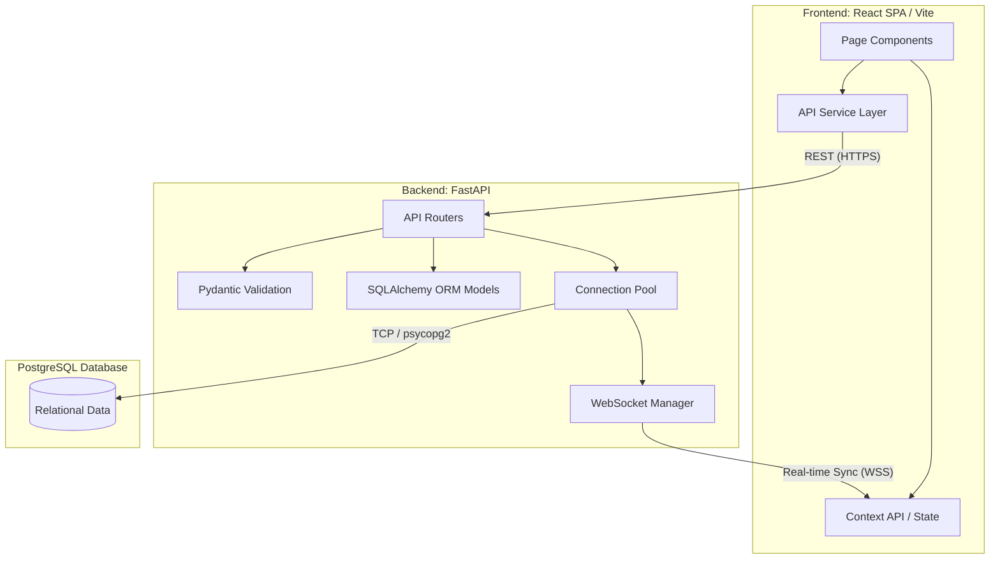
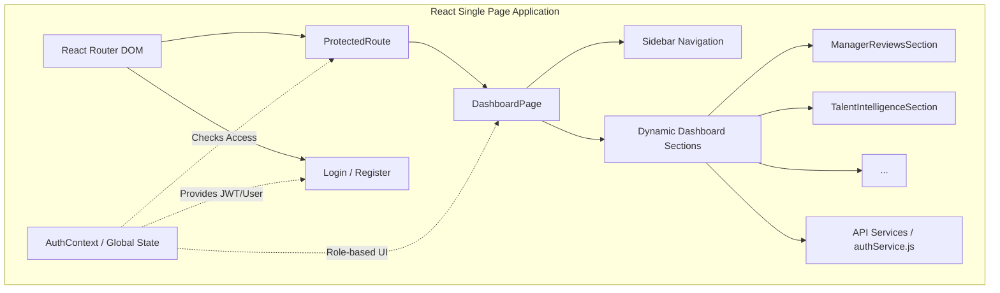
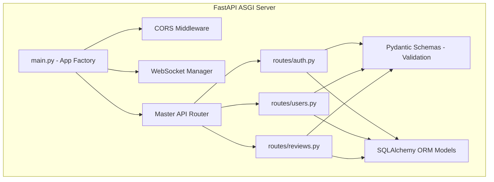
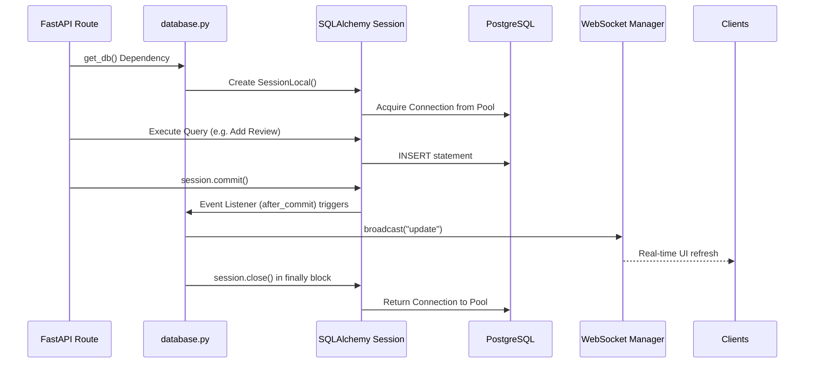

# ACME Talent Hub 🏢

A comprehensive, centralized platform for performance management, employee development, and talent intelligence. 

## 🎯 The Problem We Solve
Organizations often struggle to track employee performance and growth over time due to fragmented tools. We built ACME Talent Hub to answer critical organizational questions:
- What are the performance ratings and review history for each employee?
- Which employees have critical skill gaps in key competencies?
- Who are the high-potential employees ready for promotion?
- What training and development activities have been completed by each employee?
- Which employees are at risk of attrition based on performance trends?
- How does employee performance correlate with team and project outcomes?
- What is the distribution of skills across the organization?

---

## 🏗️ System Architecture & Structure

The ACME Talent Hub is designed using a decoupled client-server architecture, utilizing real-time WebSockets and a relational database.

### 💻 1. Frontend Architecture (`/frontend`)
The frontend is a Single Page Application (SPA) built for extreme modularity.

- **`src/App.jsx`**: The core router and theme provider. Handles code-splitting (React.lazy) and Suspense boundaries.
- **`src/context/AuthContext.jsx`**: Global state management. It manages JWT token storage (in `localStorage`), user session persistence, and dynamic UI elements based on roles (Manager vs. Employee).
- **`src/components/`**: Reusable generic UI components like `Modal` and `ProtectedRoute` (which securely intercepts unauthorized access).
- **`src/pages/`**: The main route views (`DashboardPage`, `LoginPage`, `RegisterPage`).
- **`src/pages/sections/`**: Modular, plug-and-play dashboard panels. For example, `ManagerReviewsSection` is dynamically injected into the Dashboard if the `user.role` is 'manager'.
- **`src/services/authService.js`**: An abstraction layer that cleanly encapsulates all native `fetch()` calls to the backend, catching network errors before they reach the UI.

### ⚙️ 2. Backend Architecture (`/backend`)
The backend is a high-performance ASGI web server written in Python.

- **`app/main.py`**: The application entry point. It configures CORS (allowing the frontend to communicate with it), initializes the WebSocket route, and mounts all the sub-routers.
- **`app/routes/`**: Contains endpoint logic separated by domain (e.g., `auth.py`, `users.py`, `reviews.py`). This keeps the codebase highly organized.
- **`app/schemas/schemas.py`**: Uses Pydantic to enforce strict type-checking on incoming HTTP requests and outgoing responses. If a frontend sends a string where an integer is expected, this layer rejects it with a 422 error.
- **`app/models/models.py`**: Contains the SQLAlchemy Object-Relational Mapping (ORM). Here, Python classes (like `User` or `PerformanceReview`) are defined to perfectly mirror the PostgreSQL tables.

### 🗄️ 3. Database Connection Flow (`app/database.py`)
The database connection architecture is designed for stability, high concurrency, and real-time reactivity.

- **Engine & Connection Pooling:** We use SQLAlchemy's `create_engine` connected to a PostgreSQL URI. This engine maintains a **Connection Pool** (`pool_pre_ping=True`), which keeps multiple database connections open and ready to use, preventing the overhead of creating a new TCP connection on every single API request.
- **Session Yielding:** The `get_db()` dependency generator creates a localized database session (`SessionLocal()`) for an incoming HTTP request, yields it to the route to perform queries, and strictly guarantees `db.close()` is called in a `finally` block when the request finishes, preventing memory and connection leaks.
- **Event Listeners (Real-time DB triggers):** Inside `database.py`, we use `@event.listens_for(Session, "after_commit")`. Whenever the database commits a new row (e.g., a new review is added), this listener catches the event globally and triggers the `WebSocket Manager` to broadcast an `'update'` message to the frontend, causing a seamless UI refresh.

---

## 🚀 Deployment Strategy: Why these tools?

### 1. Vercel (Frontend Hosting)
**Why Vercel?** Vercel is the creator of Next.js and heavily optimized for React/Vite. It provides a global Edge Network (CDN). Instead of hosting our frontend on a single server in New York, Vercel caches our built HTML/JS/CSS files on servers worldwide. A user in London downloads the site from a London server, resulting in instant load times. It also offers automated CI/CD directly from our GitHub repository.

### 2. Render (Backend Hosting)
**Why Render?** Render is an excellent modern Platform-as-a-Service (PaaS). We use it because it allows us to deploy our Python FastAPI backend completely for free on a containerized web service.

### 3. Supabase / Neon (Database Hosting - Forever Free)
**Why not Render for the DB?** Render's free PostgreSQL tier automatically expires and deletes your database after 90 days. To keep the project **100% forever free**, we use modern Serverless PostgreSQL providers like **Supabase** or **Neon (neon.tech)**. 

**Important Connection Considerations:**
- **Neon:** We highly recommend Neon because it natively provides IPv4 connection strings that work instantly with Render's free tier. 
- **Supabase:** If you choose Supabase, please note that their direct database connection (port `5432`) uses IPv6. **Render's free tier does NOT support IPv6.** To connect successfully, you must use Supabase's **Connection Pooler URL** (port `6543`), which routes through IPv4.

Because our backend uses SQLAlchemy, migrating is as simple as creating a free account, copying the proper `postgresql://...` connection string, and pasting it into our `.env` file—without changing a single line of code!

### 4. Cron-job.org (Keep-Alive Service)
**Why Cron-job?** We are utilizing Render's "Free Tier" to host our backend API. Render puts free web services to "sleep" after 15 minutes of inactivity to save server resources. When a service goes to sleep, the next user to visit the site will experience a 30-50 second delay (a "cold start") while the server spins back up. 
To bypass this limitation, we use `cron-job.org` to send an automated HTTP GET request to our API every 10 minutes. This tricks the Render server into thinking there is constant active traffic, preventing it from ever spinning down.
